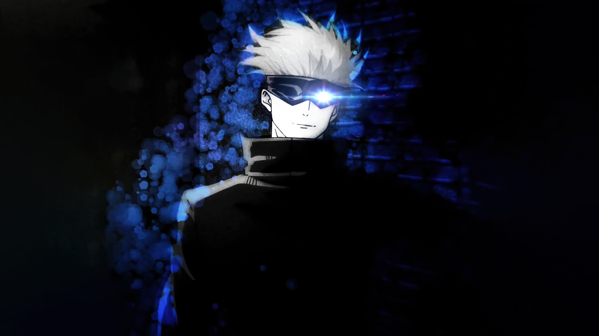

<!-- ═══════════════════════════════════════════════════════════════════════════════ --><p align="center">

<!--                        🎬  A N I M E   C I N E M A  🎬                       -->  

<!-- ═══════════════════════════════════════════════════════════════════════════════ --></p>


<div align="center"><h1 align="center"><b>Hi , I'm Omal Maleesha </b></h1>

<!--  -->

<!-- ▓▓▓ BANNER — YOUR ANIME IMAGE ▓▓▓ --><p align="center">

  <a href="https://github.com/DenverCoder1/readme-typing-svg">

    

<br/>  </a>

</p>

<!-- ▓▓▓ VENOM TITLE HEADER ▓▓▓ -->

# 💫 About Me:


<br/><br>

<br>

<!-- ▓▓▓ TYPING ANIMATION ▓▓▓ --><br>

<a href="https://git.io/typing-svg">🔭 I’m currently working on AS a Trainee Software Engineer <br>👯 I’m looking to collaborate on DevOps<br>🌱 I’m currently learning Java , Python , Js <br>💬 Ask me omalmaleesh03@gmail.com

  

</a>

## 🌐 Connect with Me

<br/>

<p align="center">

<!-- ▓▓▓ NEON DIVIDER ▓▓▓ -->  <a href="https://facebook.com/MaleeshaJayamanne" target="_blank">

    

  </a>

</div>  <a href="https://instagram.com/_maleesha_omal_" target="_blank">

    

<!-- ═══════════════════════════════════════════════════════════════════════════════ -->  </a>

<!--                         🎭  P R O L O G U E                                  -->  <a href="https://linkedin.com/in/MaleeshaJayamanne" target="_blank">

<!-- ═══════════════════════════════════════════════════════════════════════════════ -->    

  </a>

<br/>  <a href="https://medium.com/@Omalmaleesha" target="_blank">

    

<div align="center">  </a>

<table>  <a href="https://stackoverflow.com/users/omal%20maleesha" target="_blank">

<tr>    

<td width="50%">  </a>

</p>

<h2>🎭 𝙿𝚛𝚘𝚕𝚘𝚐𝚞𝚎 — 𝙰𝚋𝚘𝚞𝚝 𝙼𝚎</h2>


```javascript# 💻 Tech Stack:

const omalMaleesha = {                   

    title: "Trainee Software Engineer",## 📊 GitHub Stats:

    code: ["Java", "Python", "JavaScript", "TypeScript"],

    currentArc: "Building Full-Stack Web Apps",<div align="center">

    powers: {  

        frontend: ["React", "Angular", "Flutter"],  <br/>

        backend: ["Node.js", "Express", "Django"],  

        database: ["MySQL", "MongoDB"],  <br/>

        cloud: ["AWS"],  

        web3: ["Blockchain", "Smart Contracts", "DeFi"]</div>

    },

    currentlyLearning: ["Java", "Python", "JavaScript"],

    lookingToCollabOn: "DevOps",## 🏆 GitHub Trophies

    motto: "The code never lies. ⚡"

};

```

### ✍️ Random Dev Quote

</td>

<td width="50%" align="center">


</div>

<br/><br/>

<!-- Proudly created with GPRM ( https://gprm.itsvg.in ) -->

📧 **Reach me at:** `omalmaleesh03@gmail.com`

</td>
</tr>
</table>
</div>

<br/>

<div align="center">

</div>

<!-- ═══════════════════════════════════════════════════════════════════════════════ -->
<!--                       ⚔️  W E A P O N S  (Tech Stack)                        -->
<!-- ═══════════════════════════════════════════════════════════════════════════════ -->

<br/>

<div align="center">

<h2>⚔️ 𝚆𝚎𝚊𝚙𝚘𝚗𝚜 & 𝙰𝚛𝚜𝚎𝚗𝚊𝚕</h2>

<br/>

<h3>⟡ 𝙻𝚊𝚗𝚐𝚞𝚊𝚐𝚎𝚜</h3>
<p>
  
  
  
  
  
</p>

<h3>⟡ 𝙵𝚛𝚊𝚖𝚎𝚠𝚘𝚛𝚔𝚜 & 𝙻𝚒𝚋𝚛𝚊𝚛𝚒𝚎𝚜</h3>
<p>
  
  
  
  
  
  
  
  
  
  
</p>

<h3>⟡ 𝙳𝚊𝚝𝚊𝚋𝚊𝚜𝚎 & 𝙲𝚕𝚘𝚞𝚍</h3>
<p>
  
  
  
</p>

<h3>⟡ 𝚃𝚘𝚘𝚕𝚜 & 𝙳𝚎𝚜𝚒𝚐𝚗</h3>
<p>
  
  
  
  
  
</p>

</div>

<br/>

<div align="center">

</div>

<!-- ═══════════════════════════════════════════════════════════════════════════════ -->
<!--                     📡  P O W E R   L E V E L S  (Stats)                     -->
<!-- ═══════════════════════════════════════════════════════════════════════════════ -->

<br/>

<div align="center">

<h2>📡 𝙿𝚘𝚠𝚎𝚛 𝙻𝚎𝚟𝚎𝚕𝚜</h2>

<br/>


&nbsp;


<br/><br/>


</div>

<br/>

<div align="center">

</div>

<!-- ═══════════════════════════════════════════════════════════════════════════════ -->
<!--                      🏆  A C H I E V E M E N T S                             -->
<!-- ═══════════════════════════════════════════════════════════════════════════════ -->

<br/>

<div align="center">

<h2>🏆 𝙰𝚌𝚑𝚒𝚎𝚟𝚎𝚖𝚎𝚗𝚝 𝚄𝚗𝚕𝚘𝚌𝚔𝚎𝚍</h2>

<br/>


</div>

<br/>

<div align="center">

</div>

<!-- ═══════════════════════════════════════════════════════════════════════════════ -->
<!--                       🌐  P O R T A L S  (Socials)                           -->
<!-- ═══════════════════════════════════════════════════════════════════════════════ -->

<br/>

<div align="center">

<h2>🌐 𝙲𝚘𝚖𝚖𝚞𝚗𝚒𝚌𝚊𝚝𝚒𝚘𝚗 𝙿𝚘𝚛𝚝𝚊𝚕𝚜</h2>

<br/>

<a href="https://linkedin.com/in/MaleeshaJayamanne" target="_blank">
  
</a>
&nbsp;
<a href="https://facebook.com/MaleeshaJayamanne" target="_blank">
  
</a>
&nbsp;
<a href="https://instagram.com/_maleesha_omal_" target="_blank">
  
</a>
&nbsp;
<a href="https://medium.com/@Omalmaleesha" target="_blank">
  
</a>
&nbsp;
<a href="https://stackoverflow.com/users/omal%20maleesha" target="_blank">
  
</a>
&nbsp;
<a href="mailto:omalmaleesh03@gmail.com" target="_blank">
  
</a>

</div>

<br/>

<div align="center">

</div>

<!-- ═══════════════════════════════════════════════════════════════════════════════ -->
<!--                       📜  E N D  C R E D I T S                               -->
<!-- ═══════════════════════════════════════════════════════════════════════════════ -->

<br/>

<div align="center">

<h2>📜 𝚂𝚌𝚛𝚘𝚕𝚕 𝚘𝚏 𝚆𝚒𝚜𝚍𝚘𝚖</h2>

<br/>


</div>

<br/>

<div align="center">


</div>

<br/>

<div align="center">


<br/><br/>

<!-- ▓▓▓ FOOTER WAVE ▓▓▓ -->


<div align="center">
  
</div>

</div>


<!-- ═══════════════════════════════════════════════════════════════════════════════ -->
<!--              「 End Transmission — See you in the next episode 」                -->
<!-- ═══════════════════════════════════════════════════════════════════════════════ -->
